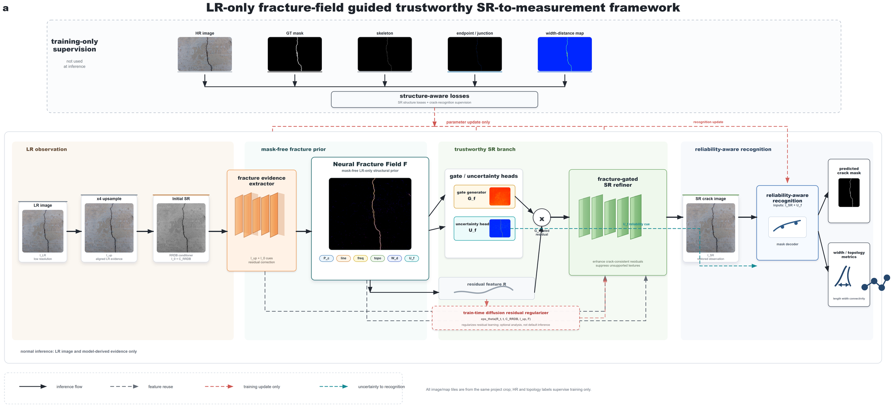
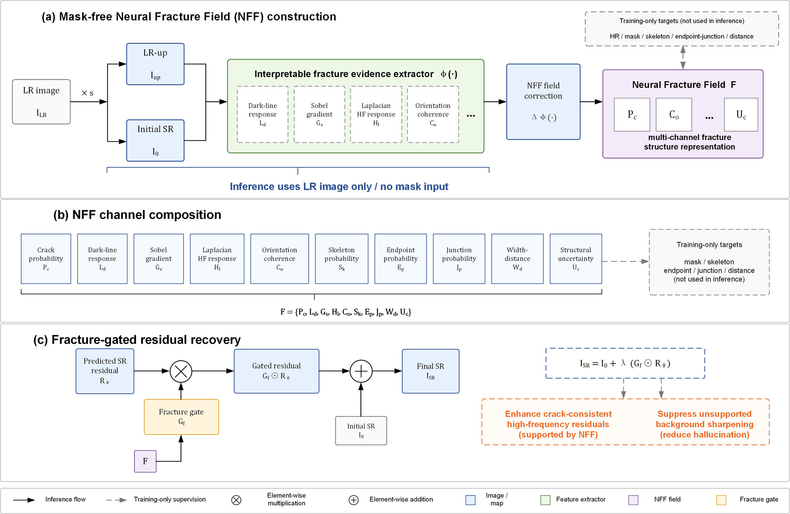
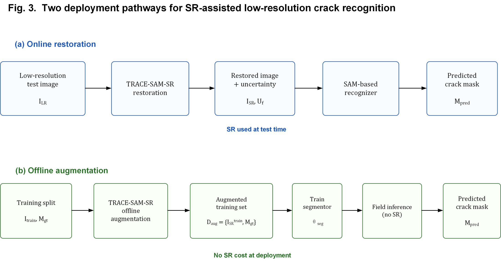

# TRACE-SAM-SR

[](pyproject.toml)
[](LICENSE)
[](https://github.com/facebookresearch/segment-anything)
[](docs/MODEL_CARD.md)

Official research implementation for **TRACE-SAM-SR**, a fracture-field guided
trustworthy super-resolution framework for low-resolution concrete crack
segmentation.

**Paper:** *Fracture-field Guided Trustworthy Super-Resolution for
Low-Resolution Concrete Crack Segmentation*

**Authors:** Baoxian Li, Yuyang Bao, Si Chen, Longsheng Bao, Jiakang Zhao, and
Ling Yu

TRACE-SAM-SR treats crack super-resolution as structure-preserving damage
recovery rather than generic visual enhancement. The model estimates a
mask-free Neural Fracture Field from LR-up and initial SR evidence, uses the
field to guide crack-consistent residual recovery, and evaluates restored images
through downstream crack segmentation and morphology-oriented metrics.

## Highlights

- **Crack-specific trustworthy SR:** restores high-frequency fracture evidence
  while suppressing unsupported crack-like background hallucinations.
- **Mask-free inference prior:** the Neural Fracture Field is inferred from
  image evidence at test time; masks and topology maps are training-only
  supervision.
- **SR-to-recognition protocol:** supports test-time restoration, training-time
  SR augmentation, recognition ablations, and SR component ablations.
- **Reproducible release package:** paper config, CPU demo config, synthetic
  demo data generator, train/evaluate/infer entry points, model card, citation
  metadata, and third-party notices.
- **Clear third-party boundary:** SAM source integration is documented and SAM
  weights are downloaded separately from Meta's official Segment Anything
  release.

## Method Overview

<p align="center">
  <a href="assets/method_framework.png">
    
  </a>
</p>

TRACE-SAM-SR has four coupled parts: an LR observation branch, a mask-free
Neural Fracture Field inferred from LR-up and initial SR evidence, a
fracture-gated SR branch, and a reliability-aware SAM recognition branch.
Solid arrows in the figure are used at inference; dashed supervision paths are
training-only and do not provide masks or topology maps at test time.

### Neural Fracture Field

<p align="center">
  <a href="assets/neural_fracture_field_mechanism.png">
    
  </a>
</p>

The Neural Fracture Field is a multi-channel fracture-structure representation.
It combines interpretable crack evidence with learned field correction, then
uses the resulting fracture gate to strengthen crack-consistent residuals and
suppress unsupported background sharpening.

### Deployment Pathways

<p align="center">
  <a href="assets/deployment_pathways.png">
    
  </a>
</p>

TRACE-SAM-SR can be used online as a restoration step before recognition, or
offline as an augmentation engine for retraining a recognizer without adding SR
latency at deployment.

## Results

Selected metrics from the manuscript workflow are included under
[docs/results](docs/results). The compact table below reports the main
single-seed release run on the Bridge Crack test split.

| Setting | Dice F1 | Boundary F1 | clDice | Length error | Notes |
| --- | ---: | ---: | ---: | ---: | --- |
| Original extractor baseline | 0.7422 | 0.7416 | 0.5971 | 0.1550 | no SR augmentation |
| TRACE-SAM-SR full-image augmentation | 0.7542 | 0.7621 | 0.6021 | 0.1572 | paper main |
| TRACE-SAM-SR threshold-calibrated | 0.7542 | 0.7592 | 0.5987 | 0.1572 | threshold 0.425 |
| Online restoration | 0.7405 | 0.7450 | 0.5872 | 0.1699 | test-time restoration |

The summary files are release evidence, not a replacement for rerunning the
protocol on the final paper split and checkpoints.

## Release Contents

```text
TRACE-SAM/
  assets/                         # method figures and selected qualitative assets
  checkpoints/
    README.md                     # checkpoint placement and expected hashes
    manifest.json                 # release checkpoint manifest template
  configs/
    demo_cpu.yaml                 # tiny CPU smoke-test config
    paper_trace_sam_sr.yaml       # paper-default training/evaluation config
    ablations/generated/          # release ablation variants
  demo_data/
    README.md
    manifest.csv                  # generated synthetic demo manifest
    bridge_crack/, country_cement/
  docs/
    DATASET_PROTOCOL.md
    MODEL_CARD.md
    THIRD_PARTY_NOTICES.md
    licenses/Apache-2.0.txt
    results/                      # selected metric summaries
  scripts/
    run_trace_sam.sh
    run_trace_sam.ps1
  trace_sam/
    data/                         # dataset loaders and degradation operators
    evaluation/                   # segmentation and SR metrics
    losses/                       # crack-aware training losses
    models/                       # TRACE-SAM-SR, extractor, and pipeline modules
    scripts/                      # training, inference, evaluation, workflow scripts
    vendors/segment_anything/     # lightly adapted SAM model-building code
  tools/
    make_demo_dataset.py
    train_sr.py
    infer_sr.py
    evaluate_sr.py
    run_full_pipeline.py
  CITATION.cff
  requirements.txt
  pyproject.toml
```

## Installation

Create an environment:

```bash
git clone https://github.com/YuyangBaoo/TRACE-SAM.git
cd TRACE-SAM

python -m venv .venv
source .venv/bin/activate
python -m pip install --upgrade pip
```

Windows PowerShell:

```powershell
git clone https://github.com/YuyangBaoo/TRACE-SAM.git
cd TRACE-SAM

py -3.10 -m venv .venv
.\.venv\Scripts\Activate.ps1
python -m pip install --upgrade pip
```

Install PyTorch for your CUDA/CPU platform first. Example for CUDA 12.1:

```bash
pip install torch torchvision --index-url https://download.pytorch.org/whl/cu121
pip install -r requirements.txt
pip install -e .
```

For CPU-only smoke tests, install the official CPU build of PyTorch, then run
`pip install -r requirements.txt`.

## Checkpoints

No large pretrained weights are committed to this repository.

Download the required SAM ViT-B checkpoint separately from Meta's official
Segment Anything release when running the full TRACE-SAM recognition branch:

```bash
curl -L -o checkpoints/sam_vit_b_01ec64.pth \
  https://dl.fbaipublicfiles.com/segment_anything/sam_vit_b_01ec64.pth
```

Windows PowerShell:

```powershell
Invoke-WebRequest `
  -Uri "https://dl.fbaipublicfiles.com/segment_anything/sam_vit_b_01ec64.pth" `
  -OutFile "checkpoints\sam_vit_b_01ec64.pth"
```

Expected SAM hash:

| File | SHA256 |
| --- | --- |
| `checkpoints/sam_vit_b_01ec64.pth` | `EC2DF62732614E57411CDCF32A23FFDF28910380D03139EE0F4FCBE91EB8C912` |

TRACE-SAM-SR checkpoints produced by this release should be placed under
`checkpoints/` or referenced through `paths.trace_sam_sr_checkpoint` and
`paths.trace_sam_checkpoint` in the YAML config.

## Paper Defaults

Paper-default settings are saved in
[configs/paper_trace_sam_sr.yaml](configs/paper_trace_sam_sr.yaml).

| Setting | Value |
| --- | --- |
| SAM backbone | `vit_b` |
| HR tile / stride | `1024 / 1024` |
| SR scale | `4` |
| TRACE-SAM-SR timesteps | `100` |
| RRDB blocks | `17` |
| Fracture-field channels | `10` |
| SR pretrain epochs | `10` |
| SR topology fine-tune epochs | `50` |
| Offline augmentation recognition epochs | `50` |
| Optimizer | AdamW for SR, Adam for recognition |
| AMP | disabled in the released paper config |

## Quick Smoke Test

The demo is a small synthetic dataset for verifying the software path. It is not
used for paper metrics.

```bash
python tools/make_demo_dataset.py --out demo_data --image-size 64 --overwrite
python -m trace_sam.scripts.validate_trace_data --config configs/demo_cpu.yaml
python tools/train_sr.py --config configs/demo_cpu.yaml --stage topology --device cpu --epochs 1 --max_batches 2 --output_name demo_trace_sam_sr
```

Expected outputs:

```text
demo_data/manifest.csv
runs/demo/config_runtime.yaml
runs/demo/model_profile.json
runs/demo/training_log.csv
runs/demo/demo_trace_sam_sr_final.pth
```

Run the dry workflow wrapper:

```bash
./scripts/run_trace_sam.sh --preset dry --device cpu
```

Windows PowerShell:

```powershell
powershell -ExecutionPolicy Bypass -File .\scripts\run_trace_sam.ps1 -Preset dry -Device cpu
```

Run the executable demo pipeline:

```bash
python tools/run_full_pipeline.py --config configs/demo_cpu.yaml --device cpu --eval_steps 4
```

This runs TRACE-SAM-SR pretraining, topology fine-tuning, SR export, and
lightweight reconstruction metrics on the bundled synthetic demo data.

## Dataset Format

The labeled crack dataset uses one `image/` and one `label/` folder per split:

```text
your_bridge_crack_data/
  train/
    image/sample_001.png
    label/sample_001.png
  val/
    image/sample_101.png
    label/sample_101.png
  test/
    image/sample_201.png
    label/sample_201.png
```

The image-only SR pretraining dataset can be either:

```text
your_hr_concrete_data/
  train/image/*.png
  val/image/*.png
```

or a flat image directory. Images and masks are paired by filename stem. For
dark-crack masks on a light background, set `data.mask_foreground: dark`; for
white foreground masks, set `light`.

## Train

TRACE-SAM-SR topology fine-tuning after preparing the real datasets:

```bash
python tools/train_sr.py \
  --config configs/paper_trace_sam_sr.yaml \
  --stage topology \
  --device cuda \
  --epochs 50 \
  --output_name trace_sam_sr_topology
```

Paper workflow template. This command requires the real Bridge Crack/Country
Cement data, SAM weights, and the compute budget implied by
[configs/paper_trace_sam_sr.yaml](configs/paper_trace_sam_sr.yaml):

```bash
python tools/run_full_pipeline.py \
  --config configs/paper_trace_sam_sr.yaml \
  --device cuda \
  --eval_steps 100
```

Resume the final offline augmentation recognition stage on three GPUs:

```bash
CUDA_VISIBLE_DEVICES=0,1,2 ./scripts/run_trace_sam.sh \
  --preset full \
  --device cuda \
  --aug-gpus 3 \
  --skip-sr-pretrain \
  --skip-sr-topology \
  --skip-sr-metric \
  --skip-joint \
  --skip-eval \
  --skip-aug
```

## Inference

Export TRACE-SAM-SR images and diagnostic maps:

```bash
python tools/infer_sr.py \
  --config configs/paper_trace_sam_sr.yaml \
  --checkpoint checkpoints/trace_sam_sr_topology_final.pth \
  --split test \
  --device cuda \
  --steps 100 \
  --out_dir runs/infer_trace_sam_sr
```

Outputs:

```text
runs/infer_trace_sam_sr/sr_images/
runs/infer_trace_sam_sr/fracture_field_summary/
runs/infer_trace_sam_sr/gate_maps/
runs/infer_trace_sam_sr/uncertainty_maps/
runs/infer_trace_sam_sr/segmentation_masks/
runs/infer_trace_sam_sr/trace_sam_sr_inference_manifest.csv
```

## Evaluate

Evaluate exported SR images against HR references:

```bash
python tools/evaluate_sr.py \
  --pred_dir runs/infer_trace_sam_sr/sr_images \
  --ref_dir /path/to/bridge_crack/test/image \
  --out_dir runs/infer_trace_sam_sr/metrics \
  --method trace_sam_sr
```

Evaluate the full SAM-based crack segmentation branch after downloading SAM and
training or providing a TRACE-SAM checkpoint:

```bash
python -m trace_sam.scripts.evaluate_trace_sam \
  --config configs/paper_trace_sam_sr.yaml \
  --checkpoint checkpoints/trace_sam_final.pth \
  --device cuda \
  --steps 100 \
  --threshold 0.5 \
  --save_predictions \
  --out_dir runs/eval_trace_sam
```

## Reproducibility Checklist

When reporting results, record:

- Git commit hash.
- YAML config file and any `--override` values.
- SAM checkpoint name and SHA256.
- TRACE-SAM-SR and TRACE-SAM checkpoint names and SHA256.
- Dataset split, mask polarity, tile size, stride, and degradation IDs.
- PyTorch, CUDA, GPU model, random seed, and exact command.
- Whether the path is test-time restoration or training-time SR augmentation.

Keep these out of git:

```text
runs/
results/
private or full-scale datasets
*.pth
*.pt
*.ckpt
```

## Data Availability

The full Bridge Crack and Country Cement training data are not bundled in this
repository. This release includes synthetic demo data for software verification,
selected metric summaries, qualitative assets, and the scripts/configs needed to
rerun the workflow with the original data.

## Third-party Code

The files under [trace_sam/vendors/segment_anything](trace_sam/vendors/segment_anything)
are lightly adapted from Meta AI's Segment Anything implementation. SAM is
licensed under Apache License 2.0; see
[docs/THIRD_PARTY_NOTICES.md](docs/THIRD_PARTY_NOTICES.md) and
[docs/licenses/Apache-2.0.txt](docs/licenses/Apache-2.0.txt).

SAM model weights are not redistributed in this repository. Download
`sam_vit_b_01ec64.pth` from the official Segment Anything release URL before
running the full recognition branch.

## License

TRACE-SAM-specific source code, docs, demo generation scripts, and release
metadata are provided under the MIT License. SAM-derived files retain their
Apache-2.0 notice.

## Citation

GitHub renders citation metadata from [CITATION.cff](CITATION.cff).

```bibtex
@misc{li2026tracesamsr,
  title  = {Fracture-field Guided Trustworthy Super-Resolution for Low-Resolution Concrete Crack Segmentation},
  author = {Li, Baoxian and Bao, Yuyang and Chen, Si and Bao, Longsheng and Zhao, Jiakang and Yu, Ling},
  year   = {2026},
  note   = {Manuscript}
}
```
